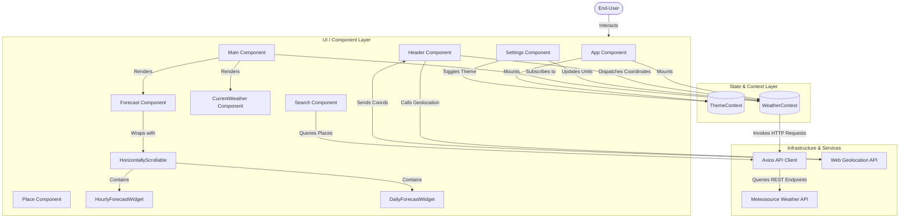
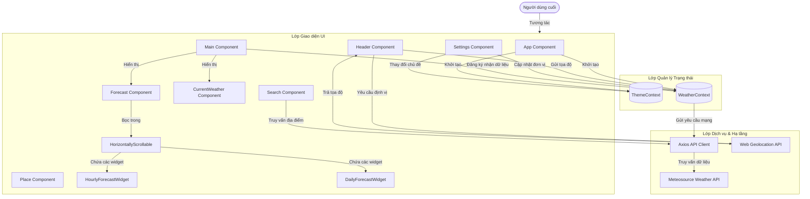

# ReactJS Weather App

<div align="center">

[](https://reactjs.org/)
[](https://sass-lang.com/)
[](https://axios-http.com/)
[](https://opensource.org/licenses/MIT)

An elegant, modern, responsive, and performance-optimized weather forecasting application built using ReactJS, Sass, Context API, and integrated with the Meteosource Weather API.

[Explore Codebase](#9-project-structure) • [View Architecture](#7-system-architecture) • [Installation Guide](#15-installation-guide)

</div>

---

# 

## 1. Project Title
**ReactJS Weather App** — A professional-grade, context-driven weather forecasting application designed for instant localized meteorological insights, featuring dynamic unit conversion, search auto-completion, and automatic theme adaptation.

---

## 2. Project Overview
The ReactJS Weather App is a responsive client-side web application designed to deliver real-time weather details and forecasts to users worldwide. Developed as a tutorial showcase for modern frontend engineering patterns, the application bridges the gap between third-party data providers and dynamic React components. 

By leveraging browser geolocation, the application immediately adapts to the user's current physical location upon launch, displaying local weather details. Users can search for any city globally, view current atmospheric details, inspect hourly trends for the current day, and examine a detailed daily forecast. The design features a responsive double-theme dashboard (Dark and Light modes) with smooth horizontal scroll mechanisms and custom SVG weather icons to provide a premium user experience.

---

## 3. Executive Summary
For product managers, stakeholders, and developers looking to evaluate this application, the ReactJS Weather App demonstrates standard React architecture practices, featuring:
* **Decoupled Architecture:** Client-side components are independent of state management and API services, keeping the UI layer pure and modular.
* **Responsive State Synchronization:** Multi-layered contexts manage state transitions for global settings, units of measure, geolocation events, and dark/light themes.
* **Low-Latency Interactions:** Search query results are processed and cached dynamically via coordinate translation systems, ensuring smooth operations on mobile and desktop platforms.
* **Polished UX/UI:** Leverages modern layout architectures (Sass/SCSS nesting, variable bindings, and flexible layout grids) combined with natural micro-interactions to create a native-app feel.

---

## 4. Key Features
* **Auto-Geolocation Discovery:** Seamless integration with the browser's `navigator.geolocation` API to auto-fetch localized weather data on startup.
* **Global Search Autocomplete:** Real-time city and region searching using the Meteosource location resolver, rendering administrative areas and country tags.
* **Multi-System Unit Conversions:** Dynamic toggle between Metric, US, UK, and CA measurement systems. Automatically converts and renders temperature, precipitation, wind speed, visibility, and cloud cover values.
* **Double Forecast View:**
  * **Hourly Forecast:** Chronological list of weather updates featuring wind direction (dynamic SVG rotation based on wind angle), temperature, and precipitation chance.
  * **Daily Forecast:** A comprehensive extended weather chart predicting the daily temperature range (minimum and maximum), precipitation accumulation, and conditions.
* **Smart Theme Toggle:** Toggleable Dark and Light interfaces with automatic system-preference checks (`prefers-color-scheme`) and persistence using LocalStorage.
* **Responsive Gesture-Friendly Lists:** Custom drag-to-scroll component for mouse/touch horizontal scrolling of hourly and daily widgets.

---

## 5. User Roles
Given the serverless, pure client-side nature of the application, there are no administrative controls or database roles. The application accommodates a single user tier:

### Guest / End-User
* **Purpose:** Access current weather updates and forecast trends for any location worldwide.
* **Permissions:** Full read access to search tools, units, themes, and weather indicators.
* **Responsibilities:** None; read-only operations.
* **Accessible Modules:** Location search bar, current weather dashboard, hourly and daily forecast grids, settings panel (measurement system toggler & theme switcher).
* **Restrictions:** Cannot save custom favorite places permanently across devices (beyond default settings) or modify raw API metadata.
* **Typical Workflow:** 
  1. Opens application.
  2. Accepts location prompts for auto-localization.
  3. Views local conditions, hourly wind/rain changes, and weekly expectations.
  4. Searches for a different city using the search bar.
  5. Switches measurement system from metric to imperial to compare values.
  6. Toggles theme settings for night-time readability.

---

## 6. Use Cases
* **Daily Commute Planning:** Users check hourly wind speeds, directions, and precipitation probabilities to decide on transit options or clothing choices.
* **Travel Forecast Checks:** Searching for destination cities prior to traveling to evaluate weather conditions over the next few days.
* **Outdoor Activity Verification:** Inspecting the UV index, humidity levels, and cloud coverage indicators to determine if weather conditions are suitable for outdoor sports or photography.
* **Device-Adaptive Reading:** Flipping between light mode (for high-contrast outdoor reading) and dark mode (for low-strain indoor night reading).

---

## 7. System Architecture
The application uses a modular, unidirectional data flow architecture powered by React's Context API. State is managed at the top-level providers and distributed to nested visual components.



---

## 8. Technology Stack
* **ReactJS (v18.3.1):** Chosen for its virtual DOM rendering capabilities, declarative component architecture, and support for hook-based state encapsulation.
* **Sass/SCSS (v1.77.6):** Preprocessor used to structure variables, handle nested selectors, compile reusable mixins, and implement color theme rules.
* **Axios (v1.7.2):** Promise-based HTTP client selected for automatic JSON transformations, query serialization, and error handling.
* **Bootstrap Icons (v1.11.3):** A lightweight icon library containing clean glyphs representing wind direction, search, location pins, and gear settings.
* **Meteosource API:** The weather data provider, offering high-resolution local weather reports, location indexing, and daily/hourly predictions.

---

## 9. Project Structure
The folder structure follows a modular React design:

```text
react-weather-app/
├── public/                 # Static assets, including custom weather icon packages
│   └── dist/
│       └── weather_icons/  # Weather condition icons organized by sets
├── src/
│   ├── api/                # API client functions and mock JSON fallbacks
│   │   ├── current-weather.json
│   │   ├── daily-forecast.json
│   │   ├── hourly-forecast.json
│   │   └── index.js
│   ├── components/         # Reusable React components
│   │   ├── CurrentWeather.js
│   │   ├── DailyForecastWidget.js
│   │   ├── Forecast.js
│   │   ├── Header.js
│   │   ├── HorizontallyScrollable.js
│   │   ├── HourlyForecastWidget.js
│   │   ├── Loader.js
│   │   ├── Main.js
│   │   ├── Place.js
│   │   ├── Search.js
│   │   └── Settings.js
│   ├── constants/          # Static application settings and unit maps
│   │   └── index.js
│   ├── context/            # React Context providers for global state
│   │   ├── theme.context.js
│   │   └── weather.context.js
│   ├── styles/             # Sass/SCSS stylesheets and design variables
│   │   ├── base/
│   │   │   └── _reset.scss
│   │   ├── components/     # Component-specific SCSS files
│   │   ├── themes/
│   │   │   └── _themes.scss
│   │   └── variables/
│   │       ├── _colors.scss
│   │       └── _variables.scss
│   ├── App.js              # Application root layout component
│   └── index.js            # Render entry point
├── package.json            # Dependencies and npm scripts
└── README.md               # Documentation (this file)
```

---

## 10. Core Business Logic
The core functional behaviors of the application depend on three main logic workflows:

### A. Geolocation vs. Search Selection Workflow
* **Default State:** At launch, the application checks if the user's browser permits geolocation access. If allowed, it coordinates with `navigator.geolocation` to request the user's latitude and longitude, updating the `isGeoLocation` flag to `true` and calling `fetchWeatherByCoordinates()`.
* **Fallback State:** If permission is denied or coordinates fail, the app falls back to `DEFAULT_PLACE` (London, place_id: `london`) and triggers `getWeatherData()`.
* **Interrupted Flow:** If the user manual-searches a city, `isGeoLocation` is set to `false`, overriding location tracking and redirecting weather calls to the manually selected place ID.

### B. Unit System Conversion Map
The measurement conversions are managed using dynamic key lookups inside `constants/index.js`. The mapping is as follows:

| System Key | Temp | Precipitation | Wind Speed | Visibility | Humidity | Cloud Cover |
| :--- | :--- | :--- | :--- | :--- | :--- | :--- |
| **metric** | °C | mm/h | m/s | km | % | % |
| **us** | °F | in/h | mph | mi | % | % |
| **uk** | °C | mm/h | mph | mi | % | % |
| **ca** | °C | mm/h | km/h | km | % | % |

### C. Drag-to-Scroll Mechanism
In the `HorizontallyScrollable.js` component, mouse gesture events translate coordinate offsets directly to container elements. Dragging moves the container's `scrollLeft` property proportionately:
$$\text{scrollLeft}_{\text{new}} = \text{scrollLeft}_{\text{old}} - (\text{clientX}_{\text{new}} - \text{clientX}_{\text{old}})$$
This provides a fluid horizontal drag experience on desktop platforms similar to mobile swipe gestures.

---

## 11. Database Design
This application is a static, frontend-only project. No backend database exists.
* **Persistent States:**
  * The theme preference (`true` for dark, `false` for light) is serialized and stored in the browser's `localStorage` under the key `theme`.
* **Runtime Data:**
  * Geolocation coordinate data, API search predictions, and weather details are retained strictly in-memory inside React State variables within `WeatherContext`.

---

## 12. API Documentation
The application communicates with the Meteosource API hosted on RapidAPI. All requests are handled in `src/api/index.js` using Axios.

### 1. Retrieve Nearest Place Info
* **Route:** `/nearest_place`
* **Method:** `GET`
* **Purpose:** Resolve latitude/longitude coordinates into a named geographical place object.
* **Request Parameters:**
  * `lat` (string): Latitude value.
  * `lon` (string): Longitude value.
  * `language` (string): Defaults to `'en'`.
* **Headers:**
  * `x-rapidapi-key`: API key credential.
  * `x-rapidapi-host`: `ai-weather-by-meteosource.p.rapidapi.com`
* **Response Sample:**
  ```json
  {
    "place_id": "london",
    "name": "London",
    "country": "United Kingdom",
    "timezone": "Europe/London",
    "type": "settlement"
  }
  ```

### 2. Search for Places
* **Route:** `/find_places`
* **Method:** `GET`
* **Purpose:** Query search matching string entries against a database of cities.
* **Request Parameters:**
  * `text` (string): User query inputs (e.g., `'Paris'`).
  * `language` (string): Defaults to `'en'`.
* **Response Sample:**
  ```json
  [
    {
      "name": "Paris",
      "place_id": "paris",
      "adm_area1": "Île-de-France",
      "country": "France"
    }
  ]
  ```

### 3. Fetch Weather by Endpoint Type
* **Route:** `/{endpoint}`
* **Method:** `GET`
* **Purpose:** Retrieve structured weather details for current, hourly, or daily queries.
* **Path Parameter:**
  * `endpoint` (string): Options include `'current'`, `'hourly'`, or `'daily'`.
* **Request Parameters:**
  * `place_id` (string): Key representing the target city.
  * `units` (string): Selected units of measure (`'metric'`, `'us'`, `'uk'`, `'ca'`).
  * `language` (string): Defaults to `'en'`.
* **Response Sample (Current Weather):**
  ```json
  {
    "units": "metric",
    "current": {
      "icon_num": 4,
      "summary": "Partly cloudy",
      "temperature": 18.5,
      "feels_like": 18.0,
      "wind": { "speed": 4.1, "angle": 210 },
      "precipitation": { "total": 0 },
      "humidity": 62,
      "uv_index": 3,
      "cloud_cover": 40,
      "visibility": 10
    }
  }
  ```

---

## 13. Authentication & Authorization
* **Application Security:** The client application does not feature user accounts, OAuth authentication, sign-ups, or login sessions.
* **API Credentials:** Requests to the Meteosource API include the RapidAPI token header key `x-rapidapi-key`. This API key is hardcoded directly inside `src/api/index.js`.

---

## 14. Application Workflow
A complete run-time breakdown of user interactions:

```text
[User Accesses App]
        │
        ▼
[Check LocalStorage / System Theme] ──► [Initialize Light or Dark Class on Body]
        │
        ▼
[Request Geolocation]
   ├──► Granted ──► [Fetch Coordinate Details] ──► [Resolve Location Name] ──► [Fetch Weather Data]
   └──► Denied  ──► [Fetch Fallback Location] ──► [Load London Data]
        │
        ├─────────────────────────────────────────────────┐
        ▼                                                 ▼
[Render User Interface]                            [User Interacts]
        │                                                 │
        │                                 ┌───────────────┼───────────────┐
        │                                 ▼               ▼               ▼
        │                          [Search City]   [Change Units]  [Toggle Theme]
        │                                 │               │               │
        │                                 ▼               ▼               ▼
        │                          [Select City]   [Re-fetch API]  [Update LocalStorage]
        │                                 │               │               │
        │                                 ▼               ▼               ▼
        └──────────────────────────► [Re-Render Layout and Weather Panels]
```

---

## 15. Installation Guide

### Prerequisites
* **Node.js:** version `16.x` or higher
* **npm:** version `8.x` or higher

### Installation Steps
1. Clone the project repository:
   ```bash
   git clone https://github.com/yourusername/react-weather-app.git
   cd react-weather-app
   ```
2. Install npm dependencies:
   ```bash
   npm install
   ```

### Running the Development Server
To launch the application in development mode with hot-reloading:
```bash
npm start
```
Open your web browser and navigate to `http://localhost:3000`.

### Production Build
To bundle the application into static files optimized for hosting environments:
```bash
npm run build
```
The output directory `build/` will be generated at the project root folder.

---

## 16. Configuration
The application settings are configured through:
* **`src/constants/index.js`:** Contains unit conversions, the fallback location object (`DEFAULT_PLACE`), and measurement mappings.
* **`src/api/index.js`:** Contains the API key constant:
  ```javascript
  const API_KEY = '79b12584b5mshc3f7e2a4f82dccep169a30jsn5936c557c87b';
  ```
  *(Note: For security reasons, this should be moved to environment configurations).*

---

## 17. Development Guide
* **Style Guide:**
  * Component styling is written using Sass/SCSS. Component stylesheets are organized under `src/styles/components/` and correspond directly to the name of the JS component.
  * Shared design variables (such as colors, margins, fonts, and sizes) are kept inside `src/styles/variables/`.
* **State Management:**
  * Always access states via the Context consumers (e.g. `useContext(WeatherContext)` or `useContext(ThemeContext)`). Avoid nesting local state variables for variables that need to be read by siblings.
* **API Calls:**
  * Any new network requests must be declared inside `src/api/index.js` and wrapped inside try-catch blocks.

---

## 18. Future Enhancements
* **Implement Local Storage Favorites:** Save searched cities to a quick-access bookmarks list.
* **Weather Alert Warnings:** Display push notifications or visual banners when meteorological authorities issue storms or high-temperature warnings.
* **Graph Forecast Visualizations:** Render weather fluctuations using charts (e.g., using Recharts or Chart.js) instead of raw text grids.
* **Dynamic Background Imagery:** Automatically update the background illustration depending on weather conditions (e.g., snow animations for winter, sunny gradient fills for dry summer days).

---

## 19. Known Limitations
> [!WARNING]
> **Hardcoded API Key:** The Meteosource API key is hardcoded directly inside `src/api/index.js`. In production deployments, this key could be exposed. It should be refactored to use environment variables (`process.env.REACT_APP_WEATHER_API_KEY`).
>
> **Missing Fallback Mocking:** If the third-party API subscription expires, the application fails to gracefully load the local backup files (`api/*.json`) without manually editing imports.
>
> **No Offline Mode Support:** The app crashes or displays empty loaders when network connectivity is lost, lacking offline service worker caching mechanisms.

---

## 20. Conclusion
The ReactJS Weather App is a clean, practical frontend weather dashboard. By utilizing modern React design patterns, SCSS variable themes, and structured context models, it demonstrates how to handle external API integrations while maintaining a clean, responsive layout.

---

# 

## 1. Tiêu Đề Dự Án
**ReactJS Weather App** — Ứng dụng dự báo thời tiết chuyên nghiệp, sử dụng kiến trúc Context API của React, được thiết kế để cung cấp thông tin khí tượng tức thì theo vị trí địa lý, hỗ trợ chuyển đổi đơn vị đo linh hoạt, tự động hoàn thành từ khóa tìm kiếm và thích ứng giao diện theo hệ điều hành.

---

## 2. Tổng Quan Dự Án
ReactJS Weather App là một ứng dụng web phía client, giúp người dùng tra cứu thông tin thời tiết thời gian thực và dự báo tương lai trên toàn cầu. Được xây dựng như một dự án mẫu minh họa cho giao diện hiện đại, ứng dụng kết nối trực tiếp với nhà cung cấp dữ liệu thời tiết bên thứ ba và hiển thị dữ liệu qua các thành phần React linh hoạt.

Nhờ tích hợp định vị của trình duyệt, ứng dụng sẽ xác định vị trí của người dùng ngay khi khởi chạy để tải thông tin thời tiết địa phương. Ngoài ra, người dùng có thể tìm kiếm bất kỳ thành phố nào, xem chi tiết tình trạng khí quyển hiện tại, theo dõi xu hướng thời tiết theo giờ trong ngày, cũng như xem dự báo chi tiết các ngày tiếp theo. Giao diện được thiết kế tối ưu, hỗ trợ hai chế độ Sáng/Tối (Light/Dark Mode), tích hợp hiệu ứng cuộn ngang mượt mà cùng bộ biểu tượng thời tiết SVG tùy biến nhằm đem lại trải nghiệm tốt nhất.

---

## 3. Tóm Tắt Dự Án
Đối với quản lý dự án, đối tác hoặc lập trình viên muốn đánh giá dự án này, ReactJS Weather App thể hiện các tiêu chuẩn kiến trúc React hiện đại qua:
* **Kiến trúc phân rã (Decoupled):** Giao diện phía client được tách biệt hoàn toàn khỏi phần quản lý trạng thái (state management) và các dịch vụ API, giúp mã nguồn hiển thị luôn tối giản và dễ bảo trì.
* **Đồng bộ trạng thái linh hoạt:** Sử dụng nhiều Context để quản lý các thay đổi về cấu hình chung, hệ đơn vị đo lường, sự kiện định vị GPS và chủ đề giao diện (Dark/Light).
* **Tương tác phản hồi nhanh:** Kết quả truy vấn tìm kiếm được xử lý và ánh xạ nhanh chóng qua hệ thống định vị tọa độ địa lý, đảm bảo tốc độ phản hồi tối ưu trên cả thiết bị di động và máy tính.
* **Giao diện & Trải nghiệm tối ưu:** Sử dụng các tiêu chuẩn thiết kế CSS hiện đại (SCSS lồng nhau, liên kết biến, lưới bố cục linh hoạt) kết hợp với các hiệu ứng chuyển động tự nhiên để mang lại cảm giác mượt mà như ứng dụng gốc.

---

## 4. Các Tính Năng Chính
* **Tự động định vị GPS:** Tích hợp trực tiếp với API `navigator.geolocation` của trình duyệt để tự động xác định vị trí người dùng khi khởi chạy ứng dụng.
* **Tìm kiếm thành phố thông minh:** Hỗ trợ tự động hoàn thành từ khóa khi tìm kiếm thành phố hoặc khu vực qua công cụ định danh địa lý Meteosource, hiển thị đầy đủ tên tỉnh/bang và quốc gia.
* **Chuyển đổi hệ đo lường linh hoạt:** Cho phép chuyển đổi nhanh giữa các hệ đo lường Metric, US, UK, và CA. Hệ thống sẽ tự động cập nhật ký hiệu của các thông số như nhiệt độ, lượng mưa, tốc độ gió, tầm nhìn và độ che phủ mây.
* **Bảng biểu dự báo kép:**
  * **Dự báo theo giờ:** Danh sách diễn biến thời tiết trong ngày, hiển thị hướng gió (xoay hình SVG động theo góc gió thực tế), nhiệt độ và xác suất mưa.
  * **Dự báo theo ngày:** Bảng dự báo thời gian dài, cung cấp khoảng nhiệt độ trong ngày (nhiệt độ cao nhất/thấp nhất), tổng lượng mưa và trạng thái thời tiết chủ đạo.
* **Tự động thay đổi chủ đề giao diện:** Hỗ trợ giao diện Sáng/Tối tùy biến, có khả năng tự động đồng bộ theo thiết lập hệ thống (`prefers-color-scheme`) và lưu lại lựa chọn của người dùng qua LocalStorage.
* **Danh sách cuộn mượt mà:** Component cuộn ngang tùy biến giúp người dùng dễ dàng kéo thả bằng chuột hoặc vuốt trên màn hình cảm ứng để xem các mục dự báo tiếp theo.

---

## 5. Vai Trò Người Dùng
Do ứng dụng chạy hoàn toàn ở phía client và không sử dụng cơ sở dữ liệu lưu trữ người dùng, dự án không phân chia quyền quản trị mà phục vụ một đối tượng duy nhất:

### Khách truy cập / Người dùng cuối
* **Mục đích:** Xem cập nhật thời tiết hiện tại và dự báo xu hướng thời tiết tại các khu vực trên toàn thế giới.
* **Quyền hạn:** Có toàn quyền sử dụng công cụ tìm kiếm, đổi đơn vị đo, chuyển đổi chủ đề giao diện và xem các chỉ số thời tiết.
* **Trách nhiệm:** Chỉ đọc dữ liệu, không cần thực hiện các thao tác quản trị.
* **Các mô-đun truy cập:** Thanh tìm kiếm địa điểm, bảng chỉ số thời tiết hiện tại, danh sách dự báo theo giờ và ngày, bảng cài đặt hệ đo lường và chủ đề.
* **Hạn chế:** Không thể lưu trữ danh sách địa điểm yêu thích cố định giữa các thiết bị khác nhau (ngoài các cài đặt mặc định của trình duyệt) hoặc thay đổi cấu trúc dữ liệu thô từ API.
* **Quy trình sử dụng điển hình:**
  1. Truy cập vào ứng dụng.
  2. Đồng ý cấp quyền truy cập định vị để ứng dụng tự động tải thời tiết địa phương.
  3. Xem các thông số hiện tại, xu hướng gió/mưa trong ngày và dự báo tuần.
  4. Tìm kiếm một thành phố khác thông qua thanh tìm kiếm.
  5. Chuyển đổi hệ đơn vị đo từ Metric sang Imperial để so sánh các chỉ số.
  6. Thay đổi chủ đề giao diện sang chế độ Tối để đọc thông tin dễ dàng hơn vào ban đêm.

---

## 6. Các Kịch Bản Sử Dụng
* **Lên kế hoạch di chuyển hàng ngày:** Người dùng kiểm tra tốc độ gió, hướng gió và khả năng mưa theo giờ để lựa chọn phương tiện di chuyển hoặc trang phục phù hợp.
* **Tra cứu thời tiết khi đi du lịch:** Tìm kiếm và xem trước thời tiết của các thành phố điểm đến trước chuyến đi để chuẩn bị hành lý.
* **Đánh giá hoạt động ngoài trời:** Theo dõi chỉ số UV, độ ẩm và độ che phủ mây để quyết định thời điểm thích hợp chơi thể thao ngoài trời hoặc chụp ảnh.
* **Đọc thông tin thích ứng ánh sáng:** Dễ dàng chuyển đổi giữa chế độ Sáng (dưới ánh nắng mặt trời) và chế độ Tối (khi đọc trong nhà vào ban đêm để tránh mỏi mắt).

---

## 7. Kiến Trúc Hệ Thống
Ứng dụng sử dụng luồng dữ liệu một chiều được quản lý bởi React Context API. Trạng thái của ứng dụng được lưu trữ tập trung tại các Provider cấp cao và phân phối đến các component giao diện bên dưới.



---

## 8. Công Nghệ Sử Dụng
* **ReactJS (v18.3.1):** Lựa chọn hàng đầu cho việc xây dựng giao diện nhờ cơ chế Virtual DOM tối ưu, kiến trúc component dễ tái sử dụng và khả năng quản lý state thông qua hooks.
* **Sass/SCSS (v1.77.6):** Công cụ tiền xử lý CSS giúp quản lý biến tập trung, lồng ghép các selector gọn gàng, định nghĩa mixin tái sử dụng và áp dụng giao diện sáng/tối dễ dàng.
* **Axios (v1.7.2):** Thư viện gọi HTTP client dựa trên Promise, tự động chuyển đổi dữ liệu sang JSON, tuần tự hóa tham số truy vấn và xử lý lỗi mạng hiệu quả.
* **Bootstrap Icons (v1.11.3):** Bộ biểu tượng gọn nhẹ cung cấp các ký hiệu trực quan cho hướng gió, tìm kiếm, ghim vị trí và cài đặt.
* **Meteosource API:** Dịch vụ cung cấp thông tin thời tiết độ phân giải cao, hỗ trợ tìm kiếm vị trí và dự báo chi tiết theo giờ/ngày.

---

## 9. Cấu Trúc Thư Mục
Dự án được tổ chức theo chuẩn cấu trúc module của React:

```text
react-weather-app/
├── public/                 # Các tài nguyên tĩnh, bao gồm bộ icon thời tiết tùy biến
│   └── dist/
│       └── weather_icons/  # Bộ icon thời tiết sắp xếp theo thư mục
├── src/
│   ├── api/                # Hàm gọi API và các file JSON dự phòng (mock)
│   │   ├── current-weather.json
│   │   ├── daily-forecast.json
│   │   ├── hourly-forecast.json
│   │   └── index.js
│   ├── components/         # Các component React tái sử dụng
│   │   ├── CurrentWeather.js
│   │   ├── DailyForecastWidget.js
│   │   ├── Forecast.js
│   │   ├── Header.js
│   │   ├── HorizontallyScrollable.js
│   │   ├── HourlyForecastWidget.js
│   │   ├── Loader.js
│   │   ├── Main.js
│   │   ├── Place.js
│   │   ├── Search.js
│   │   └── Settings.js
│   ├── constants/          # Cài đặt cố định và bảng đơn vị đo lường
│   │   └── index.js
│   ├── context/            # Các Provider quản lý trạng thái toàn cục
│   │   ├── theme.context.js
│   │   └── weather.context.js
│   ├── styles/             # Các file Sass/SCSS định nghĩa giao diện
│   │   ├── base/
│   │   │   └── _reset.scss
│   │   ├── components/     # File SCSS riêng cho từng component
│   │   ├── themes/
│   │   │   └── _themes.scss
│   │   └── variables/
│   │       ├── _colors.scss
│   │       └── _variables.scss
│   ├── App.js              # Thành phần bố cục gốc của ứng dụng
│   └── index.js            # Điểm khởi chạy render ứng dụng
├── package.json            # Quản lý thư viện phụ thuộc và câu lệnh chạy dự án
└── README.md               # Tài liệu dự án (chính là file này)
```

---

## 10. Nghiệp Vụ & Logic Lõi
Các hành vi cốt lõi của ứng dụng hoạt động dựa trên ba quy trình logic chính:

### A. Quy Trình Xác Định Vị Trí: Định Vị vs Tìm Kiếm Thủ Công
* **Trạng thái ban đầu:** Khi khởi chạy, ứng dụng sẽ kiểm tra xem trình duyệt có được cấp quyền truy cập vị trí không. Nếu có, ứng dụng sẽ gọi API định vị `navigator.geolocation` để lấy tọa độ vĩ độ và kinh độ hiện tại, đặt cờ `isGeoLocation` thành `true` và gọi hàm `fetchWeatherByCoordinates()`.
* **Trạng thái dự phòng:** Nếu người dùng từ chối cấp quyền hoặc không lấy được tọa độ, ứng dụng sẽ chuyển về địa điểm mặc định là London (`DEFAULT_PLACE`, place_id: `london`) và gọi hàm `getWeatherData()`.
* **Thay thế thủ công:** Nếu người dùng tìm kiếm một thành phố khác, cờ `isGeoLocation` sẽ được chuyển thành `false` để ngắt cơ chế định vị tự động và tập trung tải dữ liệu theo ID thành phố vừa chọn.

### B. Bản Đồ Chuyển Đổi Hệ Đo Lường
Việc chuyển đổi đơn vị đo lường được xử lý động bằng cách tra cứu khóa cấu hình trong `constants/index.js` như sau:

| Hệ đơn vị | Nhiệt độ | Lượng mưa | Tốc độ gió | Tầm nhìn | Độ ẩm | Mây che phủ |
| :--- | :--- | :--- | :--- | :--- | :--- | :--- |
| **metric** | °C | mm/h | m/s | km | % | % |
| **us** | °F | in/h | mph | mi | % | % |
| **uk** | °C | mm/h | mph | mi | % | % |
| **ca** | °C | mm/h | km/h | km | % | % |

### C. Cơ Chế Cuộn Ngang Bằng Kéo Thả Chuột
Trong component `HorizontallyScrollable.js`, các sự kiện di chuột được chuyển dịch thành giá trị cuộn của vùng chứa. Việc kéo thả sẽ thay đổi thuộc tính `scrollLeft` của container theo tỷ lệ:
$$\text{scrollLeft}_{\text{mới}} = \text{scrollLeft}_{\text{cũ}} - (\text{clientX}_{\text{mới}} - \text{clientX}_{\text{cũ}})$$
Cơ chế này đem lại trải nghiệm cuộn mượt mà trên máy tính tương tự như thao tác vuốt màn hình trên điện thoại di động.

---

## 11. Thiết Kế Cơ Sở Dữ Liệu
Dự án này chạy hoàn toàn ở phía giao diện (frontend) và không sử dụng cơ sở dữ liệu backend.
* **Lưu trữ lâu dài (Persistence):**
  * Chủ đề giao diện lựa chọn bởi người dùng (`true` cho tối, `false` cho sáng) được mã hóa dưới dạng chuỗi JSON và lưu lại trong `localStorage` của trình duyệt với khóa `theme`.
* **Dữ liệu tạm thời (In-memory):**
  * Tọa độ định vị, dữ liệu tìm kiếm thành phố và thông tin thời tiết được lưu giữ hoàn toàn trong bộ nhớ RAM thông qua các biến State của React nằm trong `WeatherContext`.

---

## 12. Tài Liệu API
Ứng dụng kết nối với API Meteosource thông qua nền tảng RapidAPI. Tất cả các yêu cầu được định nghĩa và xử lý tại file `src/api/index.js` bằng thư viện Axios.

### 1. Tìm địa điểm gần nhất theo tọa độ
* **Đường dẫn:** `/nearest_place`
* **Phương thức:** `GET`
* **Mục đích:** Tìm tên thành phố dựa trên tọa độ vĩ độ và kinh độ.
* **Tham số yêu cầu:**
  * `lat` (string): Tọa độ vĩ độ.
  * `lon` (string): Tọa độ kinh độ.
  * `language` (string): Mặc định là `'en'`.
* **Headers:**
  * `x-rapidapi-key`: Khóa API xác thực.
  * `x-rapidapi-host`: `ai-weather-by-meteosource.p.rapidapi.com`
* **Mẫu phản hồi kết quả:**
  ```json
  {
    "place_id": "london",
    "name": "London",
    "country": "United Kingdom",
    "timezone": "Europe/London",
    "type": "settlement"
  }
  ```

### 2. Tìm kiếm địa điểm theo từ khóa
* **Đường dẫn:** `/find_places`
* **Phương thức:** `GET`
* **Mục đích:** Tìm kiếm các thành phố phù hợp với từ khóa người dùng nhập vào.
* **Tham số yêu cầu:**
  * `text` (string): Từ khóa tìm kiếm do người dùng nhập (ví dụ: `'Paris'`).
  * `language` (string): Mặc định là `'en'`.
* **Mẫu phản hồi kết quả:**
  ```json
  [
    {
      "name": "Paris",
      "place_id": "paris",
      "adm_area1": "Île-de-France",
      "country": "France"
    }
  ]
  ```

### 3. Tải thông tin thời tiết theo Endpoint
* **Đường dẫn:** `/{endpoint}`
* **Phương thức:** `GET`
* **Mục đích:** Tải thông tin thời tiết hiện tại, dự báo theo giờ hoặc theo ngày.
* **Tham số đường dẫn:**
  * `endpoint` (string): Các giá trị hợp lệ gồm `'current'`, `'hourly'`, hoặc `'daily'`.
* **Tham số yêu cầu:**
  * `place_id` (string): Khóa định danh thành phố mục tiêu.
  * `units` (string): Hệ đơn vị đo lường cần lấy (`'metric'`, `'us'`, `'uk'`, `'ca'`).
  * `language` (string): Mặc định là `'en'`.
* **Mẫu phản hồi kết quả (Thời tiết hiện tại):**
  ```json
  {
    "units": "metric",
    "current": {
      "icon_num": 4,
      "summary": "Partly cloudy",
      "temperature": 18.5,
      "feels_like": 18.0,
      "wind": { "speed": 4.1, "angle": 210 },
      "precipitation": { "total": 0 },
      "humidity": 62,
      "uv_index": 3,
      "cloud_cover": 40,
      "visibility": 10
    }
  }
  ```

---

## 13. Xác Thực & Phân Quyền
* **Bảo mật ứng dụng:** Ứng dụng client-side này không có tài khoản người dùng, không tích hợp OAuth, không yêu cầu đăng ký hay đăng nhập phiên làm việc.
* **Bảo mật khóa API:** Các yêu cầu gửi tới Meteosource API được xác thực bằng khóa `x-rapidapi-key`. Khóa này hiện đang được khai báo trực tiếp (hardcode) trong file `src/api/index.js`.

---

## 14. Quy Trình Hoạt Động Của Ứng Dụng
Sơ đồ hoạt động chi tiết khi người dùng tương tác với ứng dụng:

```text
[Người dùng truy cập App]
        │
        ▼
[Kiểm tra LocalStorage / Hệ thống] ──► [Áp dụng class Sáng hoặc Tối lên thẻ Body]
        │
        ▼
[Yêu cầu quyền định vị]
   ├──► Cho phép ──► [Lấy tọa độ GPS] ──► [Tìm tên địa điểm gần nhất] ──► [Tải dữ liệu thời tiết]
   └──► Từ chối  ──► [Sử dụng vị trí mặc định] ──► [Tải dữ liệu thời tiết London]
        │
        ├─────────────────────────────────────────────────┐
        ▼                                                 ▼
[Hiển thị giao diện Dashboard]                   [Người dùng tương tác]
        │                                                 │
        │                                 ┌───────────────┼───────────────┐
        │                                 ▼               ▼               ▼
        │                          [Tìm thành phố]  [Đổi đơn vị đo] [Thay đổi chủ đề]
        │                                 │               │               │
        │                                 ▼               ▼               ▼
        │                          [Chọn thành phố] [Gọi lại API]   [Lưu LocalStorage]
        │                                 │               │               │
        │                                 ▼               ▼               ▼
        └──────────────────────────► [Cập nhật lại giao diện và thông tin thời tiết]
```

---

## 15. Hướng Dẫn Cài Đặt

### Yêu cầu hệ thống
* **Node.js:** Phiên bản từ `16.x` trở lên
* **npm:** Phiên bản từ `8.x` trở lên

### Các bước cài đặt
1. Tải mã nguồn dự án về máy:
   ```bash
   git clone https://github.com/yourusername/react-weather-app.git
   cd react-weather-app
   ```
2. Cài đặt các thư viện phụ thuộc:
   ```bash
   npm install
   ```

### Chạy dự án ở môi trường phát triển
Khởi chạy dự án ở chế độ phát triển (development mode) hỗ trợ tự động tải lại khi sửa code (hot-reloading):
```bash
npm start
```
Mở trình duyệt web và truy cập địa chỉ `http://localhost:3000`.

### Biên dịch ứng dụng cho môi trường Production
Tạo bản build tối ưu hóa cho việc triển khai lên hosting:
```bash
npm run build
```
Thư mục kết quả `build/` sẽ được tạo ra tại thư mục gốc của dự án.

---

## 16. Cấu Hình Hệ Thống
Các thiết lập của ứng dụng được cấu hình tại:
* **`src/constants/index.js`:** Chứa quy tắc chuyển đổi đơn vị đo lường, thông tin vị trí mặc định (`DEFAULT_PLACE`), và ánh xạ các đơn vị đo.
* **`src/api/index.js`:** Chứa hằng số khóa xác thực API:
  ```javascript
  const API_KEY = '79b12584b5mshc3f7e2a4f82dccep169a30jsn5936c557c87b';
  ```
  *(Lưu ý: Để bảo mật, khóa này nên được chuyển sang cấu hình biến môi trường).*

---

## 17. Hướng Dẫn Phát Triển (Dành cho Dev)
* **Quy chuẩn Style:**
  * Toàn bộ mã nguồn CSS/SCSS được quản lý bằng Sass. Các tệp style thành phần được lưu tại `src/styles/components/` và đặt tên trùng khớp với tên component JS tương ứng.
  * Các biến thiết kế dùng chung (như màu sắc, khoảng cách, font chữ) được lưu trữ tại `src/styles/variables/`.
* **Quản lý trạng thái:**
  * Mọi dữ liệu dùng chung cần được truy cập thông qua các Context consumer (ví dụ: `useContext(WeatherContext)` hoặc `useContext(ThemeContext)`). Hạn chế tạo các biến state cục bộ dư thừa đối với các dữ liệu mà component anh em cần đọc.
* **Tương tác API:**
  * Mọi yêu cầu gọi mạng mới phải được định nghĩa trong `src/api/index.js` và bọc trong các khối lệnh try-catch để kiểm soát lỗi.

---

## 18. Các Nâng Cấp Dự Kiến Trong Tương Lai
* **Lưu địa điểm yêu thích vào Local Storage:** Cho phép người dùng lưu lại danh sách thành phố hay tra cứu để chuyển đổi nhanh chóng.
* **Cảnh báo thời tiết nguy hiểm:** Hiển thị cảnh báo hoặc thông báo đẩy khi cơ quan khí tượng phát hành cảnh báo thiên tai, bão lớn hay nắng nóng cực đoan.
* **Biểu đồ hóa xu hướng thời tiết:** Thay thế dạng bảng chữ thông thường bằng các biểu đồ đường trực quan (sử dụng Recharts hoặc Chart.js) để người dùng dễ theo dõi biến động nhiệt độ.
* **Hình nền động theo thời tiết:** Tự động thay đổi hình nền hoặc hiệu ứng hoạt họa theo thời tiết thực tế (ví dụ: rơi tuyết vào mùa đông, hiệu ứng nắng vàng rực rỡ vào mùa hè).

---

## 19. Các Hạn Chế Hiện Tại
> [!WARNING]
> **Khóa API để lộ trong mã nguồn:** Khóa truy cập Meteosource API hiện đang được khai báo trực tiếp (hardcode) trong file `src/api/index.js`. Ở môi trường sản xuất, khóa này có thể bị lộ. Cần refactor để sử dụng biến môi trường (`process.env.REACT_APP_WEATHER_API_KEY`).
>
> **Chưa cấu hình Mock khi hết hạn API:** Nếu tài khoản API bị hết hạn hoặc vượt quá giới hạn lượt gọi, ứng dụng sẽ không thể tự động chuyển sang đọc các file JSON mock dự phòng (`api/*.json`) trừ khi nhà phát triển sửa code thủ công.
>
> **Chưa hỗ trợ chế độ ngoại tuyến (Offline Mode):** Khi mất kết nối mạng, ứng dụng sẽ bị treo hoặc hiển thị vòng xoay tải vô hạn do chưa tích hợp Service Worker để lưu dữ liệu đệm (cache).

---

## 20. Kết Luận
ReactJS Weather App là một ứng dụng dự báo thời tiết tinh gọn và tiện dụng. Bằng cách áp dụng các mẫu thiết kế React hiện đại, chủ đề giao diện với biến SCSS và mô hình quản lý trạng thái có cấu trúc, dự án là một ví dụ thực tiễn tuyệt vời cho việc tích hợp API bên ngoài vào một giao diện web phản hồi nhanh và hiện đại.
